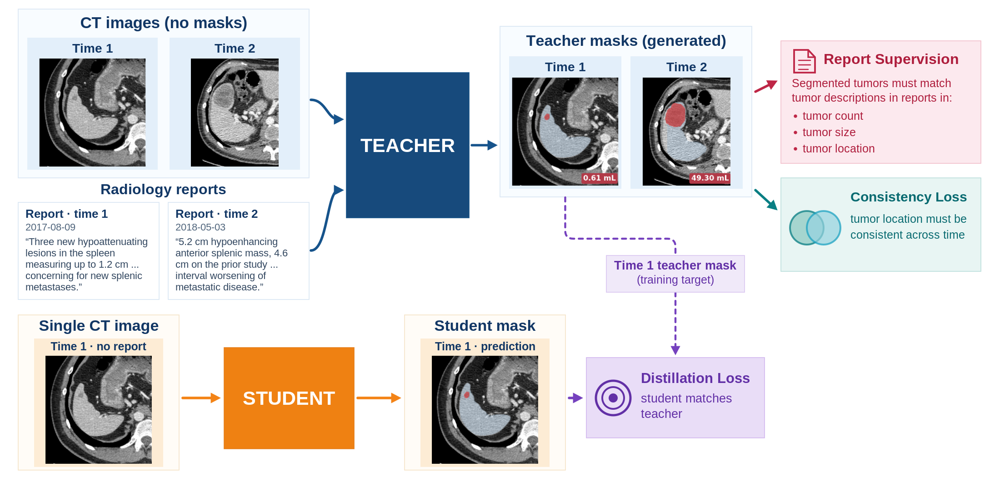
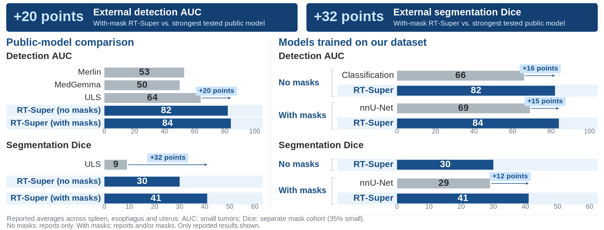
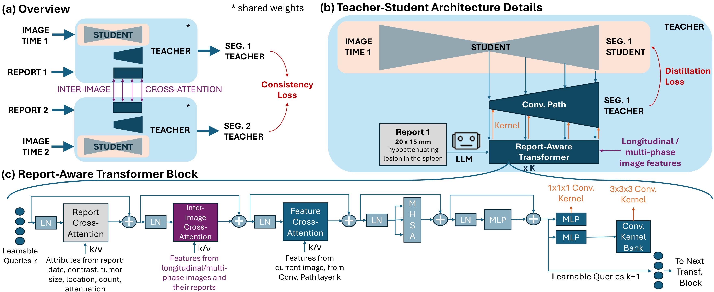

<p align="center">
  
</p>

<a href="https://papers.miccai.org/miccai-2026/paper/4075_paper.pdf">
  
</a>
<a href="document/MICCAI2026-RT-Super.pptx">
  
</a>
<a href="https://github.com/MrGiovanni/RT-Super">
  
</a>

# RT-Super

[RT-Super](https://papers.miccai.org/miccai-2026/paper/4075_paper.pdf) learns tumor detection and segmentation from **longitudinal CT scans, multi-phase images, and radiology reports**, with few or no tumor masks. At inference, the student needs **one CT scan and no report**.

## Learning from Reports and Longitudinal Images

- **Teacher:** Uses a patient's CT scans and reports to create a high-quality tumor mask for each scan missing ground-truth masks.
- **Report and consistency supervision:** The teacher is trained with Report Supervision and Consistency Losses. These losses enforce that: segmented tumors must match the reported **tumor count, size, and location**, and their locations must be consistent across time.
- **Student:** Sees one CT scan and no report. It learns to match the teacher's masks through distillation.

## Results: External Validation

**Trained in the USA, tested in Turkey.** RT-Super surpasses the tested public models in average detection AUC and segmentation Dice across **spleen, esophagus, and uterus tumors**, even without training masks.

<p align="center">
  
</p>

With training masks, RT-Super improves on the strongest tested public model by **20 AUC points and 32 Dice points**. The right-hand plots compare methods trained on our dataset, with and without masks. All models use one CT scan and no report at test time. See <a href="https://papers.miccai.org/miccai-2026/paper/4075_paper.pdf#page=8">Table 2</a> for the full results.</sub>

## Modular CNN-Transformer Architecture

**The student is part of the teacher.** The student can use any segmentation architecture. The teacher refines the student's features and output using information from reports and longitudinal images.

To refine the student's features and output, the teacher uses convolutions. These convolutions are created by the teacher's **report-aware transformer**. This transformer reads longitudinal images and reports through cross-attention and creates convolutional kernels. **Small kernels** are generated directly; **large kernels** are chosen from a kernel bank (soft mixture of experts).

<p align="center">
  <a href="document/architecture.pdf">
    
  </a>
</p>

## Papers

**RT-Super: Learning Tumor Segmentation from Longitudinal Images and Reports**  
Pedro R. A. S. Bassi, Wenxuan Li, Hanxue Gu, Jieneng Chen, Xinze Zhou, Zheren Zhu, Sezgin Er, Ibrahim E. Hamamci, Bjoern H. Menze, Gulhan E. Akan, Kang Wang, Yang Yang, Alan L. Yuille, and Zongwei Zhou.  
*MICCAI 2026, LNCS 16884. Springer Nature Switzerland.*  
[Paper](https://papers.miccai.org/miccai-2026/paper/4075_paper.pdf) · [Poster](document/MICCAI2026-RT-Super.pptx)

RT-Super builds on **[Report Supervision (R-Super)](https://github.com/MrGiovanni/R-Super)**, which introduced loss functions that use reports to supervise tumor segmentation:

**Learning Segmentation from Radiology Reports**  
Pedro R. A. S. Bassi, Wenxuan Li, Jieneng Chen, Zheren Zhu, Tianyu Lin, Sergio Decherchi, Andrea Cavalli, Kang Wang, Yang Yang, Alan L. Yuille, and Zongwei Zhou.  
*MICCAI 2025, pp. 305–315.*  
[Paper](https://papers.miccai.org/miccai-2025/paper/0049_paper.pdf) · [Springer](https://doi.org/10.1007/978-3-032-04971-1_29) · [Code](https://github.com/MrGiovanni/R-Super)

## Citations

Please cite RT-Super and the original R-Super paper when using this work:

```bibtex
@InProceedings{BasPed_RTSuper_MICCAI2026,
    author = { Bassi, Pedro R. A. S. AND Li, Wenxuan AND Gu, Hanxue AND Chen, Jieneng AND Zhou, Xinze AND Zhu, Zheren AND Er, Sezgin AND Hamamci, Ibrahim E. AND Menze, Bjoern H. AND Akan, Gulhan E. AND Wang, Kang AND Yang, Yang AND Yuille, Alan L. AND Zhou, Zongwei},
    title = { { RT-Super: Learning Tumor Segmentation from Longitudinal Images and Reports } },
    booktitle = {Medical Image Computing and Computer Assisted Intervention -- MICCAI 2026},
    year = {2026},
    publisher = {Springer Nature Switzerland},
    volume = {LNCS 16884},
    month = {September},
    page = {pending}
}

@inproceedings{bassi2025learning,
    title={Learning Segmentation from Radiology Reports},
    author={Bassi, Pedro R. A. S. and Li, Wenxuan and Chen, Jieneng and Zhu, Zheren and Lin, Tianyu and Decherchi, Sergio and Cavalli, Andrea and Wang, Kang and Yang, Yang and Yuille, Alan L. and Zhou, Zongwei},
    booktitle={International Conference on Medical Image Computing and Computer-Assisted Intervention},
    pages={305--315},
    year={2025},
    publisher={Springer},
    doi={10.1007/978-3-032-04971-1_29}
}
```


## Acknowledgement

This work was supported by the Lustgarten Foundation for Pancreatic Cancer Research, the Patrick J. McGovern Foundation Award, and the National Institutes of Health (NIH) under Award Number R01EB037669. Paper content is covered by patents pending.

© The Johns Hopkins University. This work is openly licensed via CC BY-NC-ND.
Creative Commons Attribution-NonCommercial-NoDerivatives 4.0
International Public License
